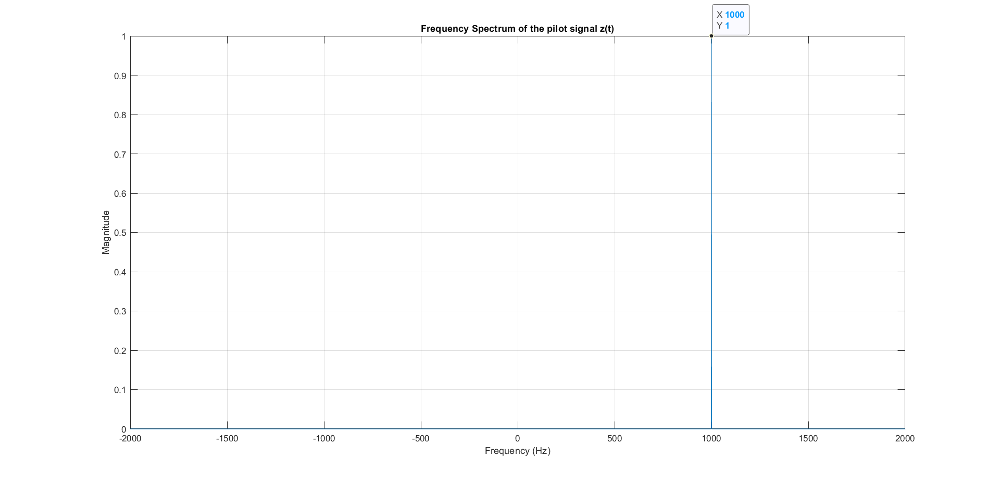
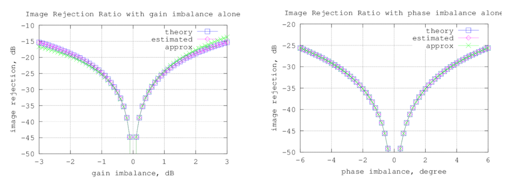
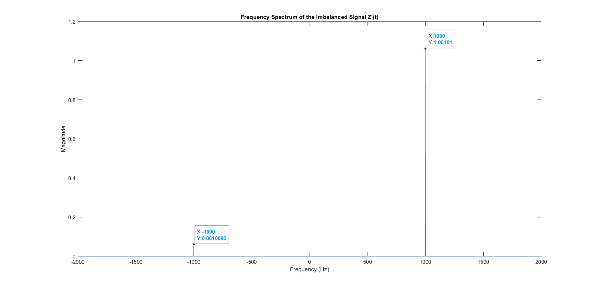
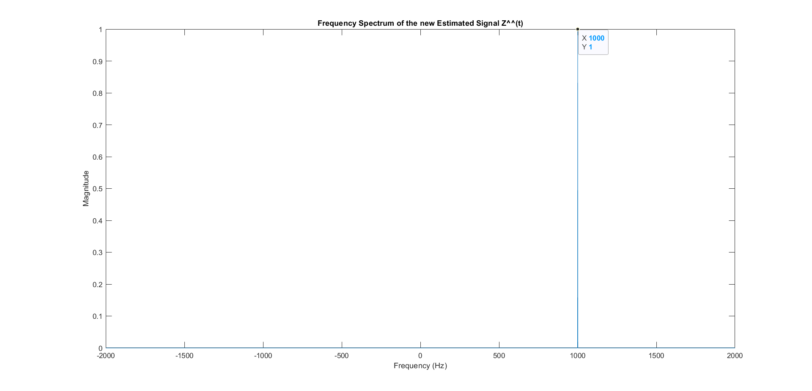

# Introduction: IQ Imbalance
In modern communication systems, particularly those employing quadrature amplitude modulation (QAM), the concept of IQ imbalance plays a critical role in system performance. IQ imbalance refers to the distortion introduced in the signal path when the in-phase (I) and quadrature (Q) components of the signal are not perfectly balanced. This imbalance can result from mismatches in the gain or phase of the I and Q channels, leading to degraded signal quality and reduced image rejection ratio (IRR).

Gain imbalance occurs when the amplitude of the I and Q channels differs, while phase imbalance arises from a phase difference between these channels. Both types of imbalance can significantly affect the integrity of the transmitted signal, causing increased interference and reduced signal-to-noise ratio (SNR). As a result, the image rejection ratio, which measures the system's ability to suppress unwanted images or sidebands, can deteriorate.

Quantifying and mitigating IQ imbalance is essential for optimizing the performance of communication systems, particularly in applications requiring high precision and low distortion. Accurate calibration and compensation techniques are necessary to correct for these imbalances, ensuring reliable and efficient communication. Understanding the impact of IQ imbalance and implementing effective compensation strategies is crucial for maintaining signal fidelity and achieving high-quality communication in complex and demanding environments.

# Design flow to Fix IQ Imbalance
>i will generate a pilot signal with Modulation frequency 1 kHz:  

$z(t) = \cos(2 \pi f_m t) + j \sin(2 \pi f_m t)$  

  
*<p style="font-size: 13px;">Figure 1: Frequency Spectrum of the pilot Signal Z(t)</p>*

---

>Then i will assume a Gain imbalance value to make the image rejection ratio (IRR) equal -25 dB. depending on the next figure the gain imbalance g = 1 dB and the phase imbalance equal zero to achive thr IRR.

  
*<p style="font-size: 13px;">Figure 2: Gain and Phase Imbalance vs IRR</p>*

---

> After we get the gain imbalance, we can calculate the imbalance signal after IRR using the follwing equation:

$Z_I'(t) = Z_I(t)$

$Z_Q'(t) = g \cos(\phi) Z_Q(t) - g \sin(\phi) Z_I(t)$

$Z'(t) = Z'_I(t) + Z'_Q(t)$ 


*<p style="font-size: 11px;">Figure 3: Frequency Spectrum of the imbalanced Signal Z'(t)</p>*  

$IIR = 20\log(1.06101/0.0610092) = 24.81 dB$

---  

> now we will try to fix the imbalanced signal by estimate a gain and phase imbalance to return the signal as the pilot.

$\hat{g} = \sqrt{\frac{\sum |z_Q'(n)|^2}{\sum |z_I'(n)|^2}}$ 

$\hat{\phi} = \frac{\sum (z_I'(n) \cdot z_Q'(n))}{\sqrt{\left(\sum |z_I'(n)|^2\right) \cdot \left(\sum |z_Q'(n)|^2\right)}}$

> after estmating the gain and phase imbalance we will use the following matrix to get the new corrected signal:

$$\begin{bmatrix}
z_I(t) \\
z_Q(t)
\end{bmatrix}=
\begin{bmatrix}
1 & 0 \\
\tan(\phi) & (g \cos(\phi))^{-1}
\end{bmatrix}
\begin{bmatrix}
z_I'(t) \\
z_Q'(t)
\end{bmatrix}$$


*<p style="font-size: 11px;">Figure 4: Frequency Spectrum of the Estemated Signal Z(t)</p>*

## Conclusion
After applying the transformation matrix, the estimated signal closely approximates the pilot signal, demonstrating the effectiveness of the matrix in addressing the imbalance issue. The matrix correction successfully compensates for the gain and phase imbalances, aligning the estimated signal with the expected pilot signal. This confirms that the applied matrix effectively mitigates the discrepancies caused by IQ imbalance, thereby solving the problem and enhancing the accuracy and reliability of the signal estimation.

```
clc
clear all
close all
% Parameters
f_m = 1e3;      % Modulation frequency (Hz)
Fs = 1e5;       % Sampling frequency (Hz)
T = 1;          % Duration of the signal (seconds)
t = 0:1/Fs:T-1/Fs;  % Time vector

% Original signal
Zi_t = cos(2 * pi * f_m * t);
Zq_t = 1j * sin(2 * pi * f_m * t);
z_t = Zi_t + Zq_t;

% Plot the signal in the frequency domain using FFT
N = length(z_t);                % Number of samples
Z_f = fftshift(fft(z_t));       % Perform the FFT and Shift zero frequency 
f = (-N/2:N/2-1)*(Fs/N);        % Frequency vector
Z_f_mag = abs(Z_f)/N;           % Normalize the magnitude

% Apply gain imbalance g = 1 and phase imbalance phi = 0 deg on Q branch
g = 10^(1/20);
phi = 0;
Zprime_i_t = Zi_t; 
Zprime_q_t = g*cos(phi)*Zq_t - g*sin(phi)*Zi_t ;
Zprime_t = Zprime_i_t + Zprime_q_t ;

% Frequency domain analysis of imbalanced signal
Zprime_f = fftshift(fft(Zprime_t));  % Centering zero frequency
Zprime_f_mag = abs(Zprime_f)/N;

% calculate Estimated g and phi
g_estimated = rms(Zprime_q_t)/rms(Zprime_i_t);
zq= abs(Zprime_q_t);
zi= abs(Zprime_i_t);
pih_estimated = sum(Zprime_q_t .* Zprime_i_t)/sqrt(sum(zq.^2) * sum(zi.^2));

% using matrix form to generat the new correct Znew_t
Znew_i_t = Zprime_i_t;
Znew_q_t = tan(pih_estimated)*Zprime_i_t +(1/(g_estimated*cos(pih_estimated)))* Zprime_q_t;
Znew_t = Znew_i_t + Znew_q_t;

% Frequency domain analysis of new signal
Znew_f = fftshift(fft(Znew_t));  % Centering zero frequency
Znew_f_mag = abs(Znew_f)/N;

% Plotting the frequency domain 
figure;
plot(f, Z_f_mag);
title('Frequency Spectrum of the pilot signal z(t)');
xlabel('Frequency (Hz)');
ylabel('Magnitude');
grid on;
xlim([-2*f_m, 2*f_m]); 

% Plotting the frequency domain
figure;
plot(f, Zprime_f_mag);
title('Frequency Spectrum of the Imbalanced Signal Z`(t)');
xlabel('Frequency (Hz)');
ylabel('Magnitude');
xlim([-2*f_m 2*f_m]); 

% Plotting the frequency domain
figure;
plot(f, Znew_f_mag);
title('Frequency Spectrum of the new Estimated Signal Z^(t)');
xlabel('Frequency (Hz)');
ylabel('Magnitude');
xlim([-2*f_m 2*f_m]); 
```
